# Práctica 1
## 1. Diferencias entre hda, sda y vda
- **HDA:** Los discos físicos en Linux se van denominando en orden alfabético, es decir que la primera unidad (la unidad primaria) se denominaría “hda”, la segunda “hdb” y así sucesivamente, HDA se refiere a las unidades físicas de almacenamiento dentro del IDE en controladora principal.
- **SDA:**  Se refiere a los discos SCSI ID address-wise, SCSI (Small Computer System Interface), es decir que SDA se refiere a las particiones que puede tener HDA, SDA también se va denominando por orden alfabético, es decir “sda” es el primero, ”sdb” la segunda partición y así sucesivamente. En si SDA es una emulación completamente virtualizada por el hypervisor.
- **VDA:** Se refiere al disco utilizando virtualization-aware disk, es decir que el VDA hace referencia al primer driver de un disco paravirtualizado, esto le da un mejor rendimiento respecto a SDA.

Las letras y números al final de los identificadores se refieren a bien, sus denominaciones “HDA” primer disco, “HDB” segundo disco, y el numero después de HD hace referencia a si son discos maestros o esclavos de determinada controladora y si se ubican en la primera, segunda o determinada partición del disco.

## 2. Montar y desmontar USB en el sistema por terminal
- Abrir la terminal en Linux
- Al usar el siguiente comando, se muestra la lista de discos duros. Entre ellos se encuentra el usb que se usará.
  ```bash
  ls /dev/sd*
  ```
  Para poder visualizar los ficheros e identificar el usb se usa:
  ```bash
  df -h 
  ```
  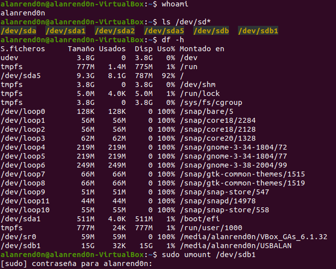
- En nuestro caso, se tuvo que desmontar el usb, debido a que la máquina virtual lo monto de manera automática. Para desmontar se hace uso del siguiente comando.
  ```bash
  sudo umount /dev/sdb1
  ``` 
- Con el comando ``` df -h ``` podemos observar que ya no se encuentra montado.
  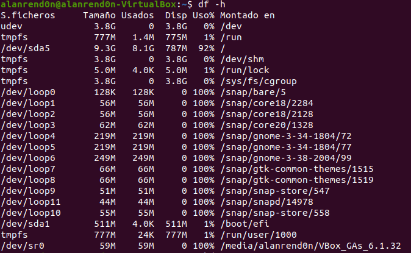
- Para montar de nuevo nuestro usb necesitamos crear una carpeta de destino. 
 
  Creamos la nueva carpeta con el comando ```mkdir ~/(dirección en donde lo quieres montar)/( nombre de la carpeta donde se montara)```
  
  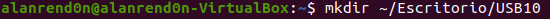
- Utilizamos el comando ```ls /dev/sd*``` de nuevo para localizar nuestro usb.

  Para montar el usb, con el comando ```sudo mount /dev/sdb1 ~/(dirección en donde lo quieres montar)/(nombre de la carpeta donde se montara)```
  
  Haciendo de nuevo uso de ```df -h``` se puede confirmar que el usb se monto de manera correcta.
  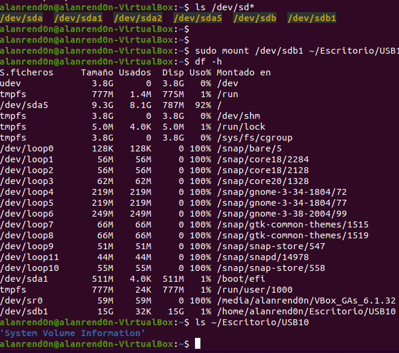


## 3. Enlistar la información de los dispositivos de bloque
- Abrimos la terminal
- Haciendo uso del comando ```lsblk``` o ```ls /dev/sd*``` se mostrará la lista de discos duros, sin importar que no se encuentren montados.
  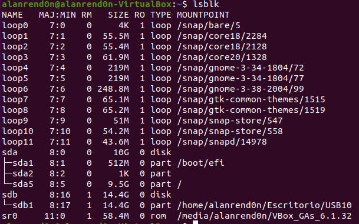

## 4. Mostrar la tabla de particiones del disco donde está instalado el sistema operativo en terminal
- Para ver las particiones de todos los discos duros se usa
  ```bash
  sudo fdisk -l
  ```
  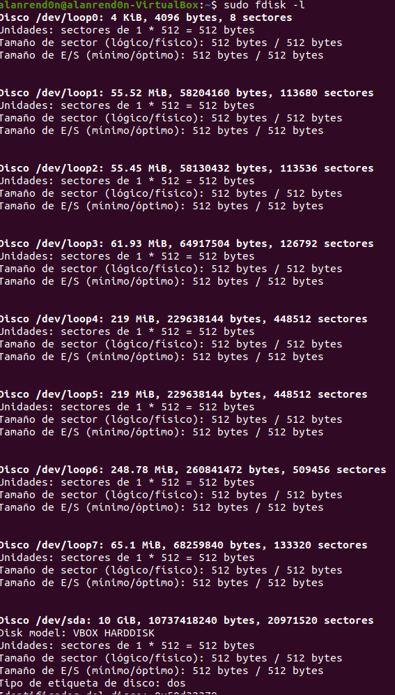
  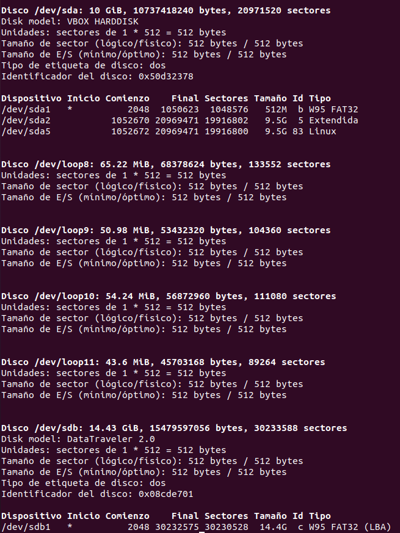
- Ingresando el comando ```sudo fdisk/dev/``` se entra al menú de fdisk y nos permite realizar varias acciones. 

  Escribiendo ```m``` podemos ver a detalle cada una de ellas.
  
  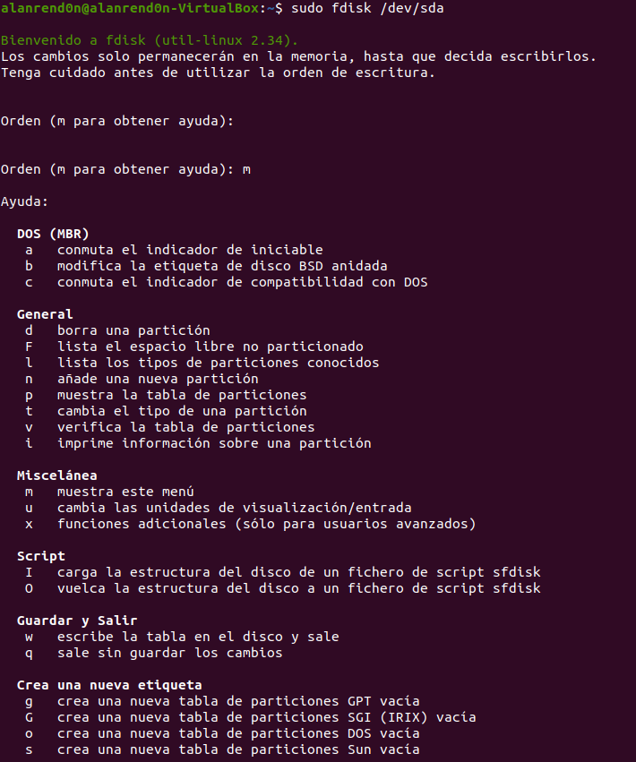
- Al escribir ```p``` se visualizan las particiones del disco
  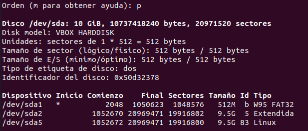
  
## 5. Conectar memoria usb y mostrar su tabla de particiones
- Abrir la terminal
- Conectamos la memoria usb.
- Haciendo uso del comando ```sudo fdisk/dev/``` y la opción ```p```, podemos observar las particiones de nuestra memoria usb.
  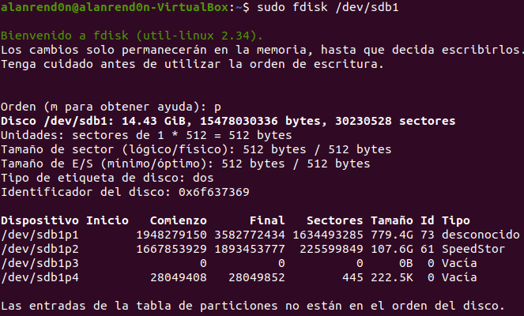
  
## 6. Borrar todas las particiones del usb 
- Abrir la terminal
- Ingresar el comando ```sudo fdisk/dev/```
- Ingresar ```d```

  Esta opción nos permite borrar cada partición individualmente.
  
  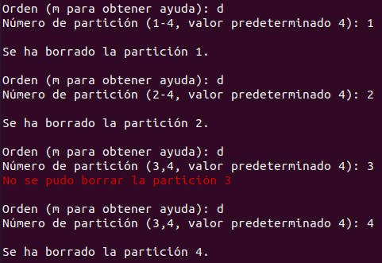
  
## 7. Crear en el usb tres particiones físicas y una extendida
- Abrir la terminal
- Ingresar el comando ```sudo fdisk/dev/```
- Ingresar ```n```
  Esta comando nos permite crear nuevas particiones, y nos da opción de que la partición sea primaria o extendida. 
  
  Con ```p``` y ```e``` elegimos respectivamnete.
  
  Para seleccionar el tamaño de la partición podemos aceptar el predeterminado con enter o darle una específica.
  
  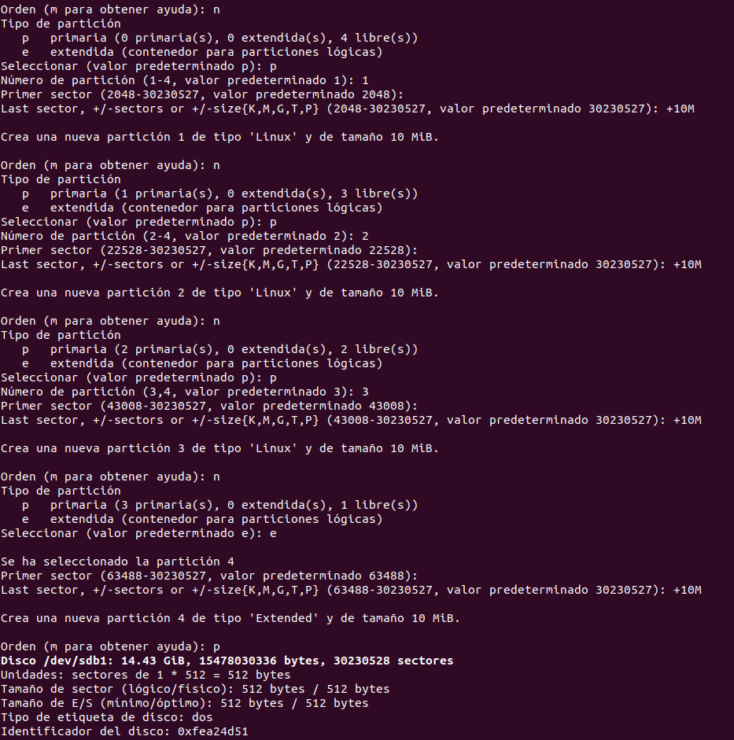
  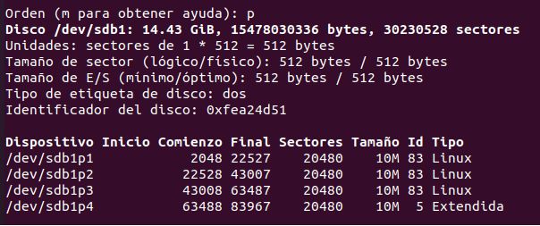
  
## 8. Crear una partición dentro de la partición extendida del usb
- Para crear una partición dentro de una partición extendida, se hará automático al querer crear otra partición y tener las 4 particiones principales dentro de la extendida.

  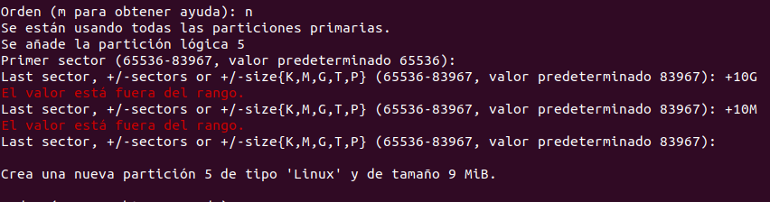
  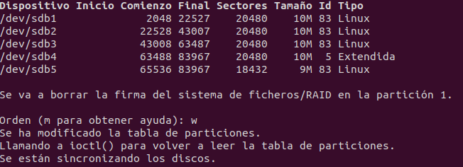
  
## 9. Borrar las particiones para que solo exista una en todo la usb, por medio de la aplicación disks
- Buscar la aplicación disks en Linux
- En el lado izquierdo de la aplicación, seleccionar la usb
  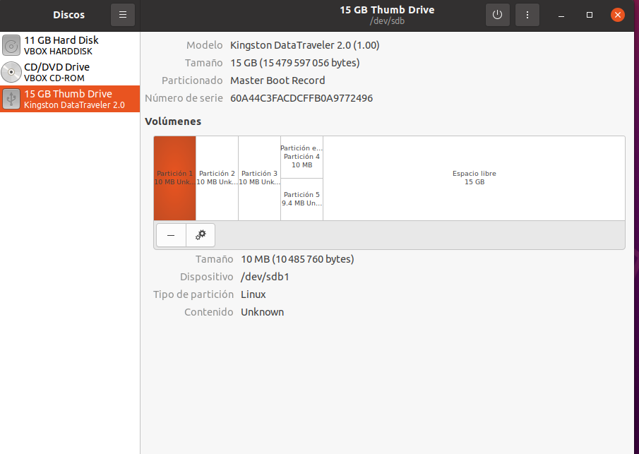
- Seleccionar la partición a eliminar
- En la parte inferior, dar click en el ícono de ```-``` y luego dar click en eliminar.
  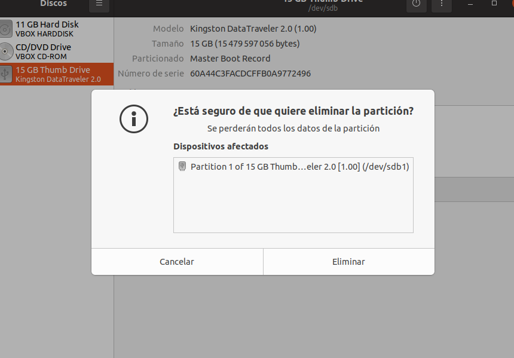
  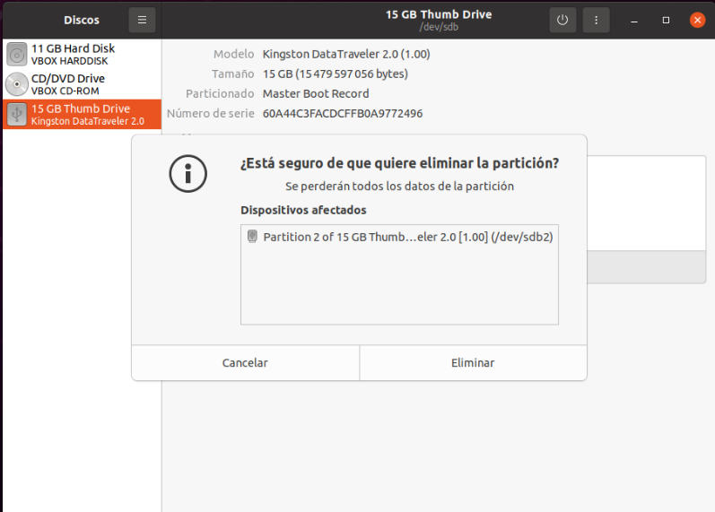
  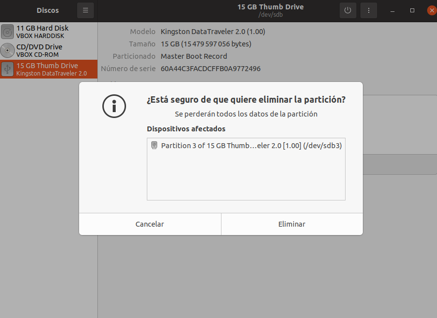
  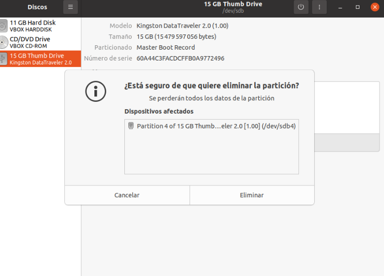
- Comprobamos que solo se muestre una partición existente
  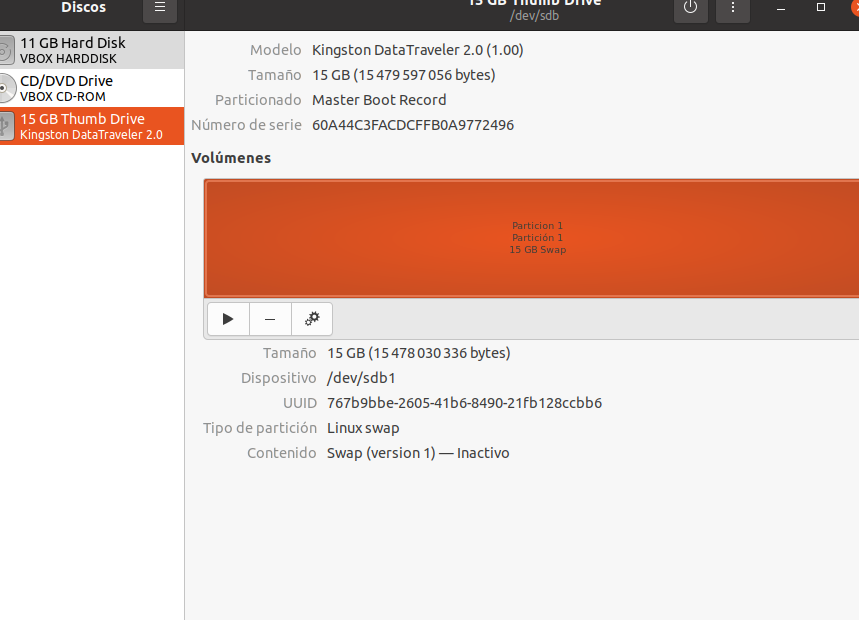
  
## 10. Copiar un archivo .iso de distribución live de linux por medio del comando "dd"
- Abrir la terminal
- Teniendo ya un archivo iso en alguna carpeta utilizamos el comando 
  ```bash
  sudo dd if=ubicacion_del_iso of=/dev/sdb
  ```
  *NOTA: En nuestro caso, como se está usando una maquina virtual con poco espacio no se pudo descargar completamente el archivo iso, es por eso que aparece 0 registros leídos y escritos.*
  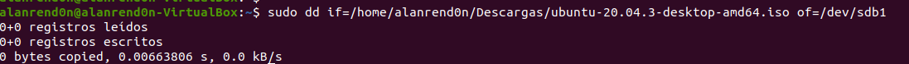
  

## Referencia
[Explicación de términos de Ubuntu Linux para su unidad de disco duro y sus dispositivos | Dell México](https://www.dell.com/support/kbdoc/es-mx/000132092/ubuntu-linux-t-eacute-rminos-para-el-disco-duro-y-dispositivos-que-se-explican#:~:text=dev%2Fhda%20-%20primary%20disk%20on,secondary%20disk%20on%20second%20controller)
